# Windows 11 STIG 05: V-253404 (WN11-CC-000280)

**Status:** Published
**STIG:** DISA Microsoft Windows 11 Security Technical Implementation Guide v2r7
**Finding:** V-253404 (WN11-CC-000280)

Part of the [DISA STIG Implementation with PowerShell](https://github.com/goubx/DISA-STIG-Implementation-w-PowerShell-series-) series.

---

## Overview

This entry hardens a stock Azure Windows 11 VM against one finding from the DISA Microsoft Windows 11 STIG v2r7 using PowerShell. The workflow:

1. Scan an unhardened Azure VM with Tenable's DISA STIG compliance audit.
2. Pick a failed finding from the Audit tab.
3. Remediate it manually to confirm the fix path.
4. Translate that fix into an idempotent PowerShell function.
5. Rescan to confirm the finding moves to passed.

Registry-based finding under `HKLM:\SOFTWARE\Policies\Microsoft\Windows NT\Terminal Services`. The manual fix is a single GPO toggle; the PowerShell equivalent is a short `Set-ItemProperty` script.

---

## Target Platform

| Field            | Value                          |
|------------------|--------------------------------|
| OS               | Windows 11 Pro                 |
| Azure VM         | Standard                       |
| Private IP       | 10.1.0.102                     |
| Domain joined    | No                             |

---

## Tools Used

| Tool                          | Purpose                                       |
|-------------------------------|-----------------------------------------------|
| Tenable Nessus                | Scanning with the DISA STIG audit             |
| Windows PowerShell ISE        | Remediation engine                            |
| Local Group Policy Editor     | Manual remediation pass                       |
| Registry Editor               | State verification before and after the fix   |
| STIG Viewer                   | Finding reference (Check + Fix text)          |
| Azure                         | Lab VM hosting                                |

---

## Lab Setup

The lab uses a stock Azure Windows 11 VM with Windows Defender Firewall disabled so the Tenable scanner can reach the host across the lab network:


> Note: this is a lab-only step. In production you would scope firewall rules to permit the scan engine rather than disabling the firewall outright.

---

## Scan Configuration

The Tenable scan that produced this finding uses the Advanced Network Scan template, configured once and reused across all findings in this series:

1. **Scans, Create Scan, Advanced Network Scan**
2. Name: `GOUB-STIG-IMPLEMENTATION`
3. Target: the VM's private IP (`10.1.0.102`)
4. Scanner: internal scan engine
5. Credentials: local administrator on the VM

### Compliance audit

Under the Compliance tab, the DISA Microsoft Windows 11 STIG v2r7 audit is added:


### Plugin scoping

To keep the scan fast and focused on STIG findings only, every plugin family is disabled except one:

1. Plugins, filter for `policy`, enable **Policy Compliance**.
2. Inside Policy Compliance, enable only **Windows Compliance Checks** (Plugin ID 21156).

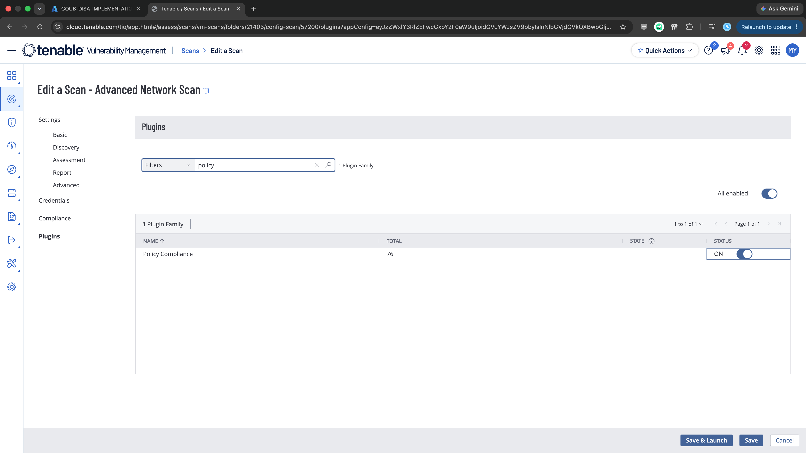

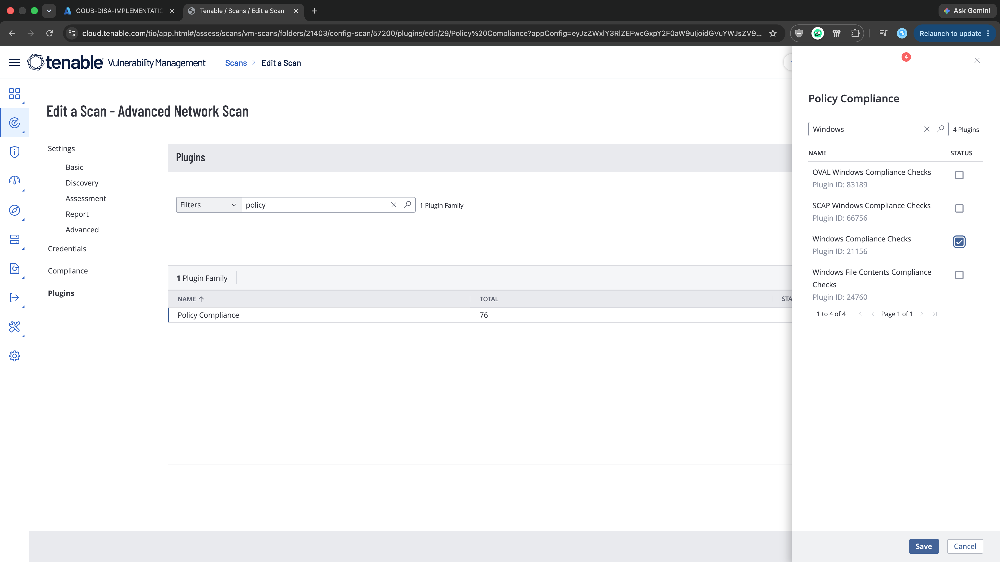

---

## Initial Scan

The scan against the Azure VM returned 147 failed audits out of 263 total checks. STIG findings on a default Windows 11 image are dense, which makes this a good source of remediation work.

The finding this repo documents:

> **WN11-CC-000280** : Remote Desktop Services must always prompt a client for passwords upon connection.

Without this control, an RDP client can supply saved credentials automatically at connection time, so anyone with access to a machine that has a stored password in an .rdp file (or a cached credential) can reach the terminal server without ever typing the password. Forcing the prompt at the server side neutralizes that shortcut.

---

## Finding Details

Pulled from the STIG Viewer entry and cross-checked against the Tenable audit detail:

| Field            | Value                          |
|------------------|--------------------------------|
| STIG ID          | WN11-CC-000280                 |
| Vulnerability ID | V-253404                       |
| Severity         | Medium (CAT II)                |
| CCI              | CCI-002038                     |
| Rule ID          | SV-253404r1051052_rule         |

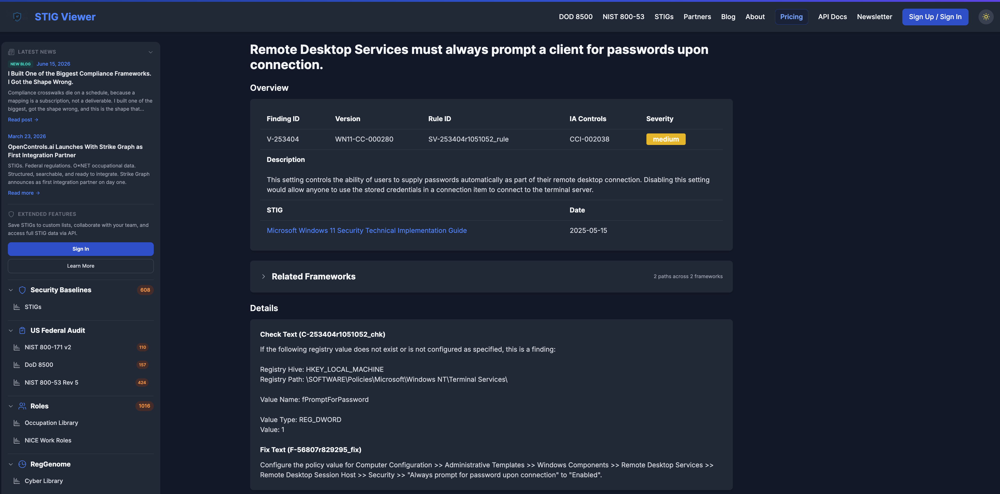

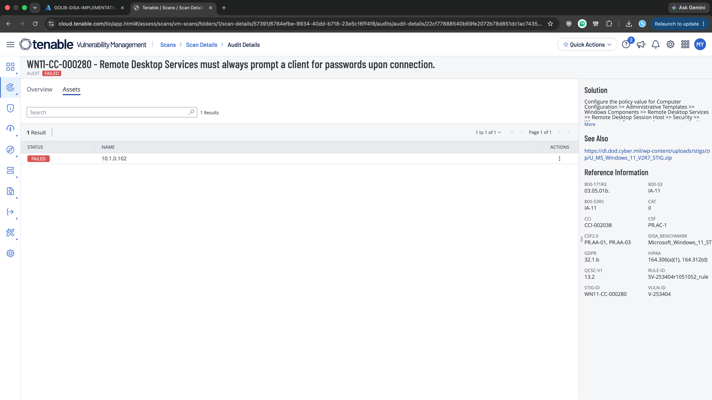

**Why it matters:** RDP allows credentials to be supplied automatically as part of the connection, either from a stored password in a saved .rdp file or from cached credentials on the client. If the terminal server does not force a password prompt of its own, anyone sitting at a client with those saved credentials can reach the server without proving they know the password. Enforcing the prompt on the server ensures the password check happens at the target, not the client.

**Fix per DISA:**
> Configure the policy value for Computer Configuration > Administrative Templates > Windows Components > Remote Desktop Services > Remote Desktop Session Host > Security > "Always prompt for password upon connection" to "Enabled".

Translated to the registry:

| Field         | Value                                                                    |
|---------------|--------------------------------------------------------------------------|
| Hive          | HKEY_LOCAL_MACHINE                                                       |
| Path          | `\SOFTWARE\Policies\Microsoft\Windows NT\Terminal Services`              |
| Value Name    | fPromptForPassword                                                       |
| Value Type    | REG_DWORD                                                                |
| Value Data    | 0x00000001 (1)                                                           |

---

## Step 1: Manual Remediation

Before touching anything, I opened Registry Editor (`regedit.exe`) and navigated to `HKLM\SOFTWARE\Policies\Microsoft\Windows NT\Terminal Services` to confirm the current state. The key existed with `KeepAliveEnable` and `KeepAliveInterval`, but no `fPromptForPassword` value:

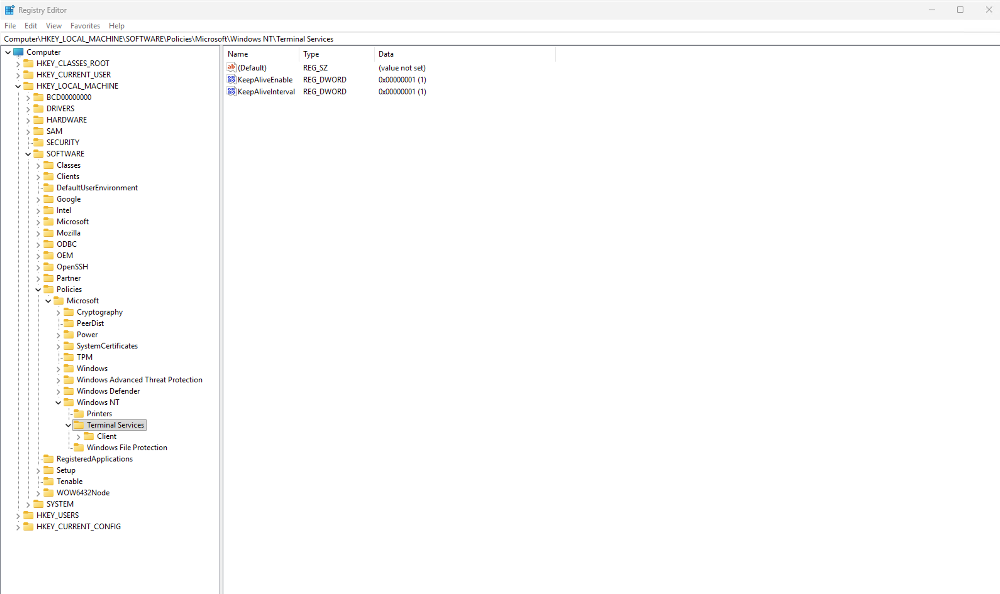

Missing value = the check fails, which matches what Tenable reported.

Opened Local Group Policy Editor (`gpedit.msc`) and navigated to:

> Computer Configuration > Administrative Templates > Windows Components > Remote Desktop Services > Remote Desktop Session Host > Security

Then set **"Always prompt for password upon connection"** to **Enabled**:

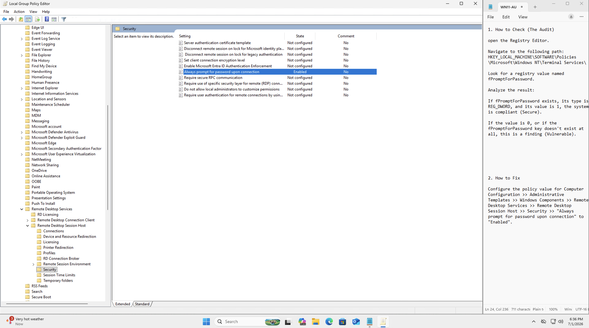

Back in Registry Editor, the `fPromptForPassword` DWORD now exists with value `0x00000001`, confirming the GPO push landed at the registry level:

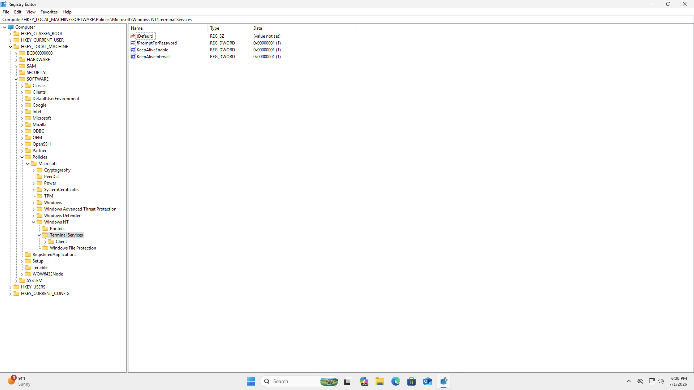

After rerunning the Tenable scan, the finding passes:

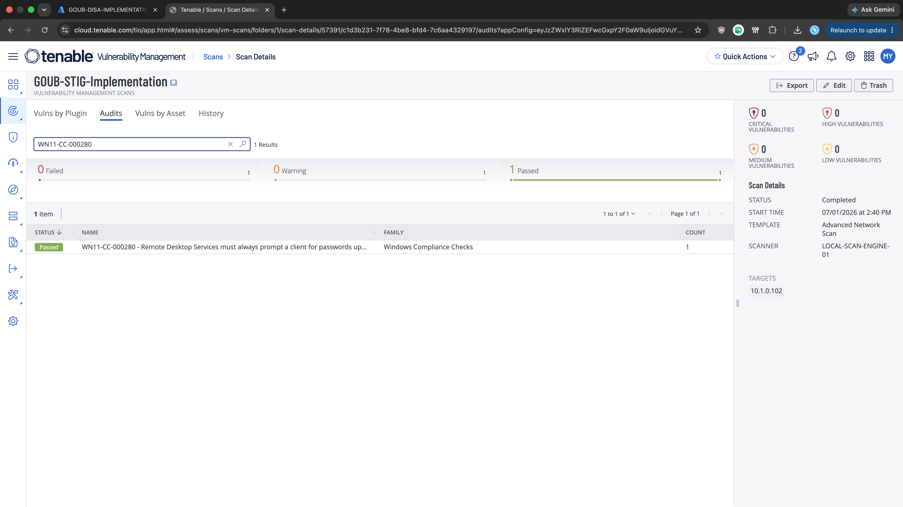

The manual fix works. Now to translate it into a script.

---

## Step 2: Capture the Registry Export

The correct registry state, after the GPO change, is:

```reg
Windows Registry Editor Version 5.00

[HKEY_LOCAL_MACHINE\SOFTWARE\Policies\Microsoft\Windows NT\Terminal Services]
"fPromptForPassword"=dword:00000001
```

That tells the script exactly what to produce: the `Windows NT\Terminal Services` key under `Policies\Microsoft`, a DWORD named `fPromptForPassword`, and the value `0x00000001`.

---

## Step 3: Revert and Re-verify

I reverted the Group Policy setting back to "Not Configured" and reran the scan. The finding is failed again, as expected:

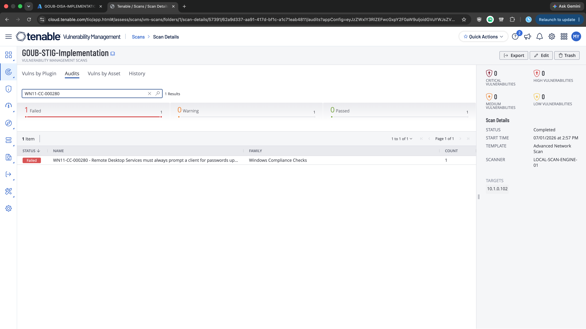

Now there's a clean baseline to validate the script against.

---

## Step 4: PowerShell Remediation

```powershell
function Set-StigRule-V253404 {
    <#
    .SYNOPSIS
        V-253404: Remote Desktop Services must always prompt a client for passwords upon connection.

    .DESCRIPTION
        Severity:        CAT II (Medium)
        STIG ID:         WN11-CC-000280
        CCI:             CCI-002038
        Tenable Plugin:  Windows Compliance Checks (21156)
        Reference:       DISA Microsoft Windows 11 STIG v2r7

        Forces the Remote Desktop Session Host to prompt for a password at
        connection time, regardless of any credentials the client passes
        along. Sets fPromptForPassword to 1 under the Terminal Services
        policy key, which is the registry change Group Policy makes when
        enabling "Always prompt for password upon connection".

    .EXAMPLE
        Set-StigRule-V253404
    #>
    [CmdletBinding(SupportsShouldProcess)]
    param()

    $RegPath = 'HKLM:\SOFTWARE\Policies\Microsoft\Windows NT\Terminal Services'
    $Name    = 'fPromptForPassword'
    $Desired = 1   # 1 = Enabled (always prompt for password on RDP connection)

    # Create the registry path if it does not exist
    if (-not (Test-Path $RegPath)) {
        New-Item -Path $RegPath -Force | Out-Null
        Write-Host "Created registry path: $RegPath"
    }

    # Apply the fPromptForPassword value
    Set-ItemProperty -Path $RegPath -Name $Name -Value $Desired -Type DWord -Force
    Write-Host "Set $Name to $Desired in $RegPath"

    # Verify
    $Current = (Get-ItemProperty -Path $RegPath -Name $Name).$Name
    if ($Current -eq $Desired) {
        Write-Host "Compliant: $Name = $Current"
    } else {
        Write-Warning "Non-compliant: $Name = $Current, expected $Desired"
    }
}
```

What it does, in order:

1. **Check path.** `Test-Path` confirms whether the `Terminal Services` policy key exists.
2. **Create if missing.** `New-Item -Force` creates the key and any missing parents.
3. **Set the value.** `Set-ItemProperty` writes `fPromptForPassword` as a DWord with the desired data (1).
4. **Verify.** Reads the value back and emits a Compliant or Non-compliant line.

Running it from an elevated PowerShell ISE session against the reverted baseline:

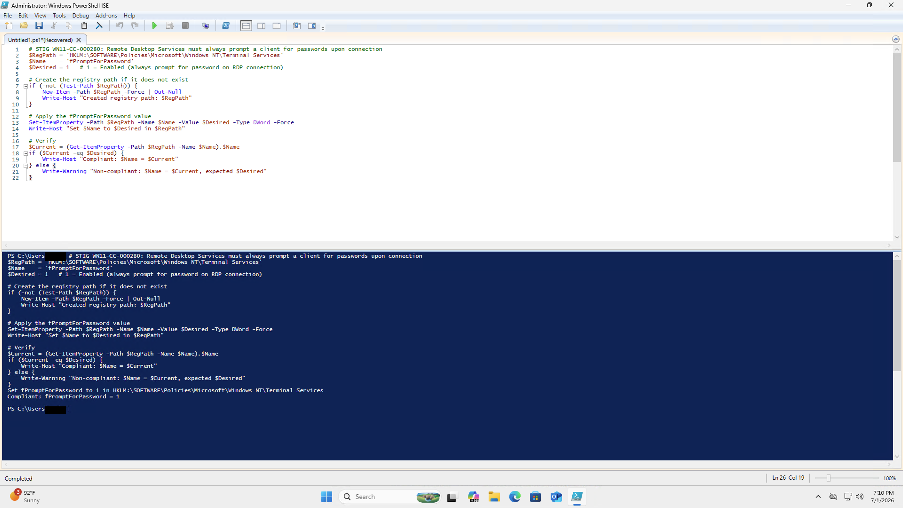

Output:

```
Set fPromptForPassword to 1 in HKLM:\SOFTWARE\Policies\Microsoft\Windows NT\Terminal Services
Compliant: fPromptForPassword = 1
```

The `Created registry path` line does not appear this run because the `Terminal Services` key already existed on the baseline (with `KeepAliveEnable` and `KeepAliveInterval`), so only the value needed to be written.

---

## Step 5: Final Validation

After rerunning the same Tenable scan, the finding passes:

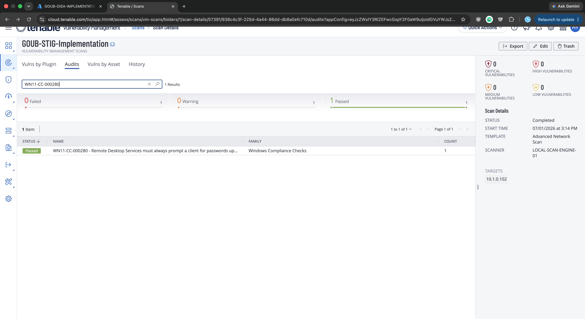

---

## Result

| Stage                        | WN11-CC-000280 |
|------------------------------|----------------|
| Initial scan                 | Failed         |
| After manual remediation     | Passed         |
| After reverting              | Failed         |
| After PowerShell remediation | Passed         |

The finding was cleared both by hand and programmatically, with the scan-pass state proven against a clean baseline both times.

---

## Notes

### Operational impact
The setting forces the Remote Desktop Session Host to prompt for a password on every incoming RDP session, even when the client passes credentials in the connection request. Users who relied on saved passwords in .rdp files or cached credentials will now be asked for the password on every connect. No services restart, and existing RDP sessions are unaffected until the next connection.

### Registry key already existed
On the baseline VM the `Terminal Services` policy key already contained `KeepAliveEnable` and `KeepAliveInterval` values, so the script only needed to add `fPromptForPassword` rather than create the key. The `if (-not (Test-Path))` block is still worth keeping: on a clean image or a different Windows SKU the key may not be present, and without the guard the `Set-ItemProperty` call would fail.

---

## References

- [DISA STIG Library](https://public.cyber.mil/stigs/)
- [STIG Viewer entry for V-253404](https://www.stigviewer.com/stigs/microsoft_windows_11/2025-05-15/finding/V-253404)
- [Tenable Plugin Database](https://www.tenable.com/plugins/search)
